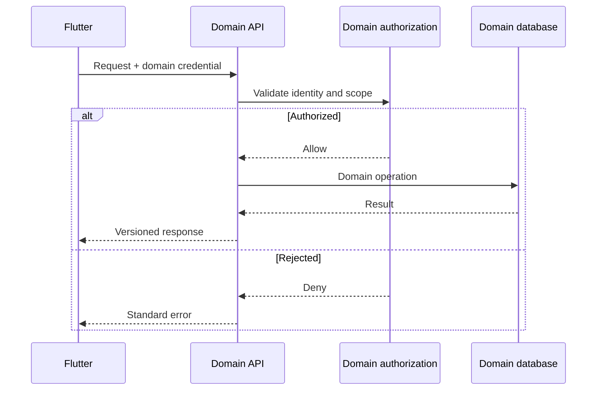

# Request Flow

```mermaid
sequenceDiagram
  participant App as Flutter
  participant API as Domain API
  participant Auth as Domain authorization
  participant DB as Domain database
  App->>API: Request + domain credential
  API->>Auth: Validate identity and scope
  alt Authorized
    Auth-->>API: Allow
    API->>DB: Domain operation
    DB-->>API: Result
    API-->>App: Versioned response
  else Rejected
    Auth-->>API: Deny
    API-->>App: Standard error
  end
```
