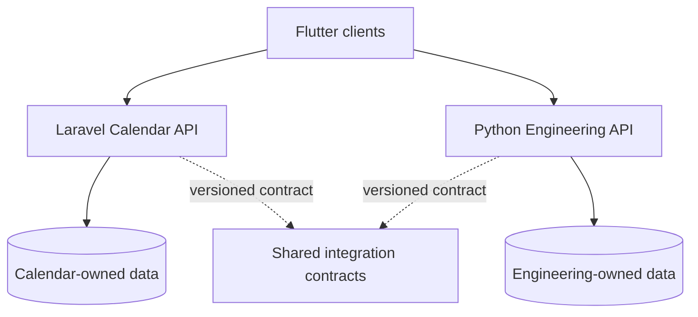

# System Overview

```mermaid
flowchart TB
  F[Flutter clients]
  F --> L[Laravel Calendar API]
  F --> P[Python Engineering API]
  L --> D1[(Calendar-owned data)]
  P --> D2[(Engineering-owned data)]
  L -. versioned contract .-> C[Shared integration contracts]
  P -. versioned contract .-> C
```

Shared contracts do not imply shared persistence or shared credentials.
